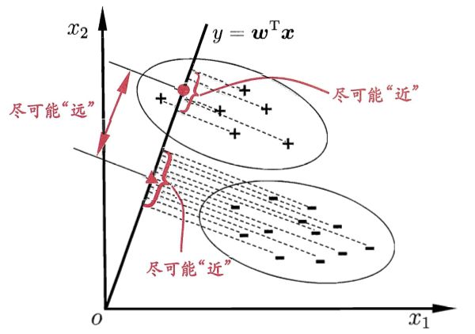

# 线性判别分析（LDA）

+ 组内距离小，组间距离大

给定数据集$D=\{(x_i,y_i)\}^m_{i=1}$ ，$y_i \in Y = \{0,1,...,k\}$ ，令$N_i$ 、$X_i$、$\mu_i$ 、 $\Sigma_i$分别表示第 $i \in Y$类示例的样本个数、样本集合、均值向量、协方差矩阵。
$$
\text{均值向量：}\mu_i = \dfrac{1}{N_i}\sum_{x \in X_i}{x}
$$
$$
\text{协方差矩阵：}\Sigma_i=\sum_{x \in X_i}(x-\mu_i)(x-\mu_i)^T
$$
$$
\text{组内散度：}\Sigma_w = \sum_{i \in Y}{\Sigma_i}
$$
$$
\text{组间散度：}\Sigma_b =\sum_{i \in Y}{(u_i-u)(u_i-u)^T}\\
u = \text{mean}(u_i)
$$

在保证组间散度大的同时，让组内散度尽可能的小，所以我们可构造目标函数：
$$
\text{max } J(\omega) = \dfrac{\omega^TS_b\omega}{\omega^TS_w\omega}
$$

这就是LDA欲最大化的目标。即$S_b$与$S_w$的“广义瑞利商”，其中$\omega$为最佳投影向量。

## 如何确定最佳投影向量

构造新的函数$L(\omega)$

$$
\text{max }L(\omega)=\omega^TS_b\omega-\lambda\omega^TS_w\omega
$$
最大值在导数为0处取得，故对$L(\omega)$求导。

因为$S_b$和$S_w$均为对称矩阵，所以$L(\omega)$的导数可以写为：
$$
\dfrac{\partial{L}}{\partial{\omega}}=2S_b\omega - 2S_w\omega=0
$$

即：
$$
S_b\omega=\lambda S_w\omega
$$
$$
S_w^{-1}S_b\omega=\lambda\omega
$$

因此我们只要求出$S_w^{-1}S_b$的特征向量，就求出了$\omega$。

