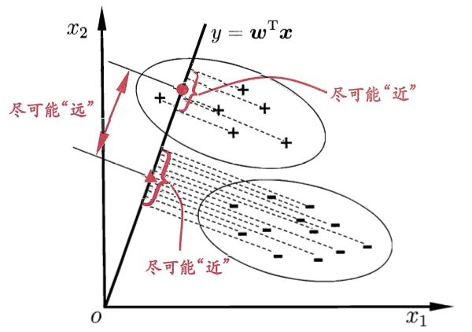

# 线性判别分析（LDA）



+ 组内距离小，组间距离大

给定数据集$D=\{(x_i,y_i)\}^m_{i=1}$ ，$y_i \in Y = \{0,1,...,k\}$ ，令$N_i$ 、$X_i$、$\mu_i$ 、 $\Sigma_i$分别表示第 $i \in Y$类示例的样本个数、样本集合、均值向量、协方差矩阵。
$$
\text{均值向量：}\mu_i = \dfrac{1}{N_i}\sum_{x \in X_i}{x}
$$
$$
\text{协方差矩阵：}\Sigma_i=\sum_{x \in X_i}(x-\mu_i)(x-\mu_i)^T
$$
$$
\text{组内散度：}S_w = \sum_{i \in Y}{\Sigma_i}
$$
$$
\text{组间散度：}S_b =\sum_{i \in Y}{(u_i-u)(u_i-u)^T}\\
u = \text{mean}(u_i)
$$

在保证组间散度大的同时，让组内散度尽可能的小，所以我们可构造目标函数：
$$
\text{max } J(\omega) = \dfrac{\omega^TS_b\omega}{\omega^TS_w\omega}
$$

这就是LDA欲最大化的目标。即$S_b$与$S_w$的“广义瑞利商”，其中$\omega$为最佳投影向量。

## 如何确定最佳投影向量

构造新的函数$L(\omega)$

$$
\text{max }L(\omega)=\omega^TS_b\omega-\lambda\omega^TS_w\omega
$$
最大值在导数为0处取得，故对$L(\omega)$求导。

因为$S_b$和$S_w$均为对称矩阵，所以$L(\omega)$的导数可以写为：
$$
\dfrac{\partial{L}}{\partial{\omega}}=2S_b\omega - 2S_w\omega=0
$$

即：
$$
S_b\omega=\lambda S_w\omega
$$
$$
S_w^{-1}S_b\omega=\lambda\omega
$$

因此我们只要求出$S_w^{-1}S_b$的特征向量，就求出了$\omega$。

通过对特征值排序，确定主要特征值的索引
# 实现

组内散度
```python
        u = {}
        Sw = np.zeros((data.shape[1],data.shape[1]))
        for i in label:
            u[i]    = data[target == i]
            u[i]    = np.mean(u[i],axis=0)
            u[i]    = np.mat(u[i])
            sub_Sw  = (u[i].T) * u[i]
            Sw     += sub_Sw
```

组间散度
```python
        Sb = np.zeros((data.shape[1],data.shape[1]))
        u["all"] = np.mean(list(u.values()),axis=0)
        for i in label:
            sub_Sb = (u[i]-u["all"]).dot((u[i]-u["all"]).T)
            Sb    += sub_Sb
```
求解广义瑞利商，得到特征值和特征向量
```python
        S = np.linalg.inv(Sw).dot(Sb)
        eigVals,eigVects = np.linalg.eig(S)
```
选择特征向量主要的前n维进行降维

```python
        eigValInd = np.argsort(-eigVals)
        eigValInd = eigValInd[:n_dim]
        w = eigVects[:,eigValInd]
        data_ndim = np.dot(data,w)
```


```python
def lda(data,target,n_dim):
    """
    :data: data
    :target: label
    :n_dim: dim after LDA
    """
    label = np.unique(target)
    Nlabel = len(label)-1
    if n_dim > Nlabel:
        return print("n_dim should <=",Nlabel)
    else:
        u = {}              #sub_data
        Sw = np.zeros((data.shape[1],data.shape[1]))
        for i in label:
            u[i]    = data[target == i]
            u[i]    = np.mean(u[i],axis=0)
            u[i]    = np.mat(u[i])
            sub_Sw  = (u[i].T) * u[i]
            Sw     += sub_Sw

        Sb = np.zeros((data.shape[1],data.shape[1]))
        u["all"] = np.mean(list(u.values()),axis=0)

        for i in label:
            sub_Sb = (u[i]-u["all"]).dot((u[i]-u["all"]).T)
            Sb    += sub_Sb

        S = np.linalg.inv(Sw).dot(Sb)
        eigVals,eigVects = np.linalg.eig(S)
        eigValInd = np.argsort(-eigVals)
        eigValInd = eigValInd[:n_dim]
        w = eigVects[:,eigValInd]
        data_ndim = np.dot(data,w)

        return data_ndim


if __name__ == '__main__':
    iris = load_iris()
    X = iris.data
    Y = iris.target
    data = lda(X,Y,2)
    data_2 = LinearDiscriminantAnalysis(n_components=2).fit_transform(X, Y)
    plt.figure(figsize=(8,4))
    plt.subplot(121)
    plt.title("my_LDA")
    plt.scatter(data[:,0],data[:,1],c=Y)
    plt.subplot(122)
    plt.title("sklearn_LDA")
    plt.scatter(data_2[:, 0], data_2[:, 1], c = Y)
    plt.savefig("LDA.png")
    plt.show()
    # print(X.shape,Y.shape)
```


