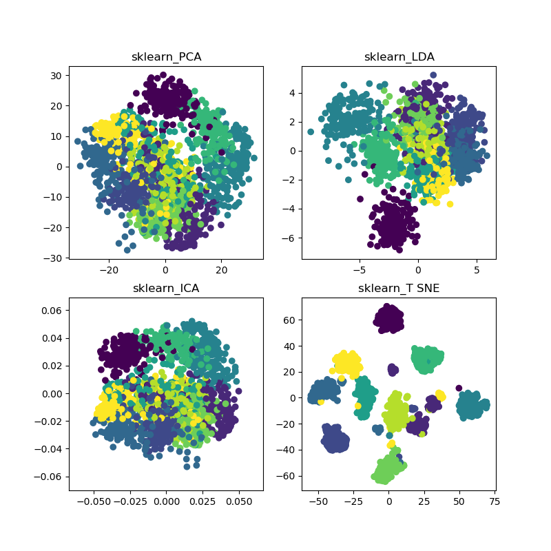

# PCA
[PCA.py](https://github.com/demonlord1997/algorithm/blob/master/PCA/PCA.py)

# LDA
[LDA.py](https://github.com/demonlord1997/algorithm/blob/master/LDA/LDA.py)

# FastICA
[FastICA.py](https://github.com/demonlord1997/algorithm/blob/master/FastICA/FastICA.py)

# The use of TSNE
[Tsne.py](https://github.com/demonlord1997/algorithm/blob/master/The use of TSNE/Tsne.py)

