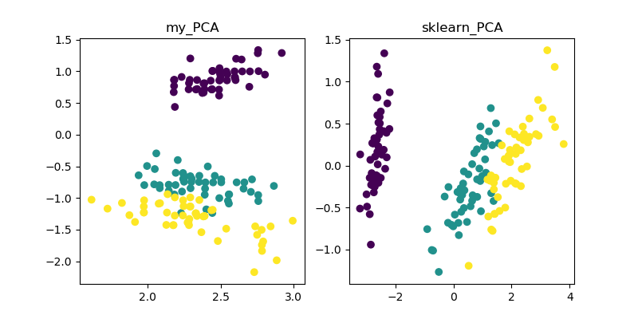
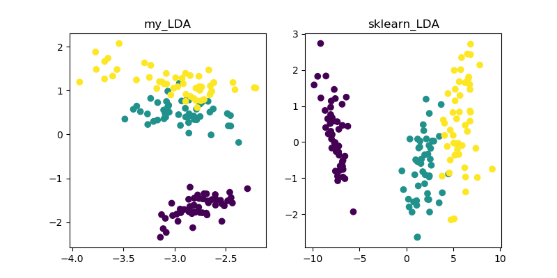
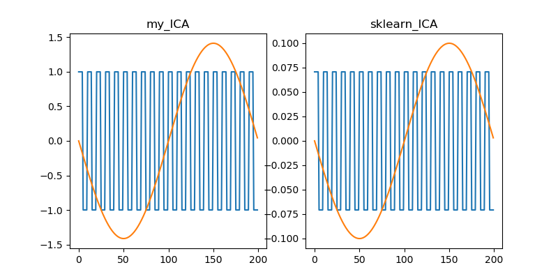
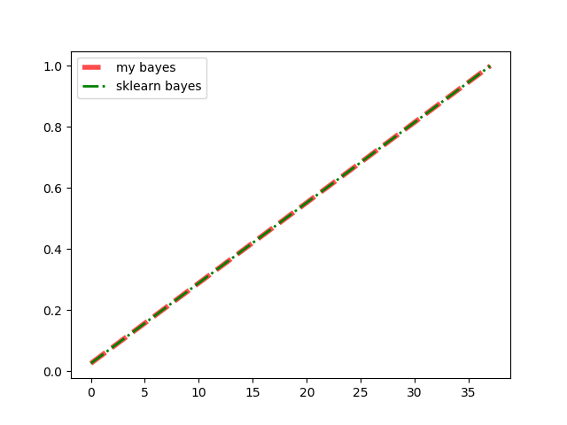

# PCA
[PCA.py](./PCA/PCA.py)

# LDA
[LDA.py](./LDA/LDA.py)

# FastICA
[FastICA.py](./FastICA/FastICA.py)

# The use of TSNE
[The use of Tsne(sklearn)](./The%20use%20of%20TSNE/Tsne.py)

# CSP
[csp.py](./CSP/csp.py)

[CSP equation](./CSP/README.md)

# Bayes
[Bayes.py](./Bayes/Bayes.py)

